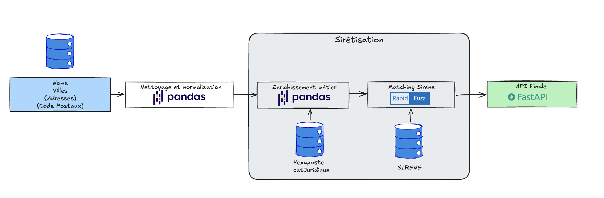

# 🏷️ Siretizator Lite – Identifiez les SIRET en un clic

> Une application légère pour enrichir vos fichiers avec des identifiants SIRET fiables, à partir du nom et de la commune.

---

## Essayez l'application

Application déployée ici :  
👉 [**Siretizator Lite**](https://siretizator.onrender.com/)  

---

## Objectif du projet

**Siretizator Lite** est un outil simple et rapide pour **sirétiser des bases de données clients**, sous forme d’**application web** et d’**API REST**.  
À partir du **nom d'une entité** et de sa **commune**, il identifie le **SIRET le plus probable** en s’appuyant sur des techniques de **matching flou**.

---

## Documentation

L’API REST est entièrement documentée et testable via Swagger :  
👉 [**Documentation interactive → /docs**](https://siretizator.onrender.com/docs)

Endpoints disponibles :
- `/siretize` : sirétisation individuelle (JSON)
- `/siretize_bulk` : sirétisation de fichiers CSV

---

## Schéma du pipeline

### Étapes du traitement :

1. **Chargement des données**  
   Le fichier contient les noms, villes, et éventuellement adresses ou codes postaux.

2. **Nettoyage et normalisation**  
   Homogénéisation des chaînes (accents, casse, typographie) via `pandas`.

3. **Enrichissement métier**  
   Ajout de variables comme le **code hexaposte** ou la **forme juridique**.

4. **Matching SIRENE**  
   Correspondance floue avec la base nationale **SIRENE**, via `RapidFuzz`.

5. **API finale**  
   Tout le pipeline est encapsulé dans une API `FastAPI`, disponible en ligne.

---

## Stack technique

- **Python** : `pandas`, `RapidFuzz`, `FastAPI`  
- **Déploiement** : `Render`  
- **CI/CD** : `GitHub Actions` 

---

## Données utilisées

Les correspondances SIRET reposent sur la base **SIRENE®**, maintenue par l’Insee, publiée en open data sous la **licence Etalab “Open Licence”**.

- 🔗 [sirene.fr](https://www.sirene.fr)  
- 🔗 [data.gouv.fr – Sirene](https://www.data.gouv.fr/fr/datasets/r/)

Pour des raisons de performance, cette version utilise une **extraction ciblée** de la base Sirene, limitée aux **acheteurs publics** (collectivités, ministères, établissements publics).  
Dataset allégé disponible ici :  
👉 [Hugging Face – SIRENE_Client](https://huggingface.co/datasets/LucasPotin98/SIRENE_Client)

---

## Application dérivée d’un projet en production

Cette version Lite est issue du projet complet **Siretizator**, conçu pour retrouver les SIRET de n’importe quelle entité (entreprise, collectivité, association) à partir de données partielles.

Le pipeline a été développé dans le cadre de ma thèse, pour la construction de la base **FOPPA**, recensant les marchés publics publiés au TED entre 2010 et 2020.  
👉[FOPPA sur Zenodo](https://zenodo.org/records/10879932)

### Projets associés

- [Siretizator – GitHub](https://github.com/LucasPotin98/Siretizator)  
- [FoppaInit – GitHub](https://github.com/CompNet/FoppaInit)

---

## 👨‍💻 Auteur

Projet développé par **[Lucas Potin](https://lucaspotin98.github.io/)**  
*Data Scientist – Modélisation & Graphes*
